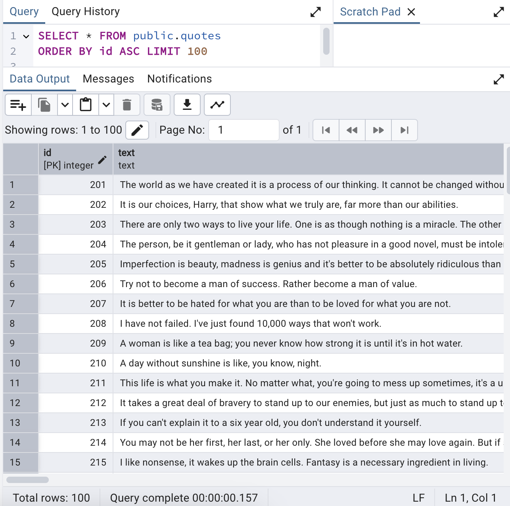

## Inspire Quotes Pipeline Project

## Overview
This project extracts quotes from [quotes.toscrape.com](http://quotes.toscrape.com), cleans and analyzes the data, and stores it in a PostgreSQL database for further analysis.

## Technologies 
- Python
- BeautifulSoup
- PostgreSQL
- psycopg2
- Pandas
- pgAdmin

## Project Pipeline

1. **Web Scraping** : Collected quotes, authors, and tags from 10 pages.
2. **Data Transformation** : Cleaned quote text, normalized author names, and structured tags.
3. **Data Storage** : Inserted into PostgreSQL using `psycopg2`.
4. **Data Analysis** : 
   - Top authors
   - Tag frequency
   - Filter quotes by keywords

## PostgreSQL Table Screenshot
After running the ETL pipeline, all quotes were successfully inserted into the PostgreSQL database. Here's a preview from pgAdmin:

## Exported Results
Located in `exports/`:
- `cleaned_quotes.csv`
- `tag_counts.csv`
- `multi_quote_authors.csv`

